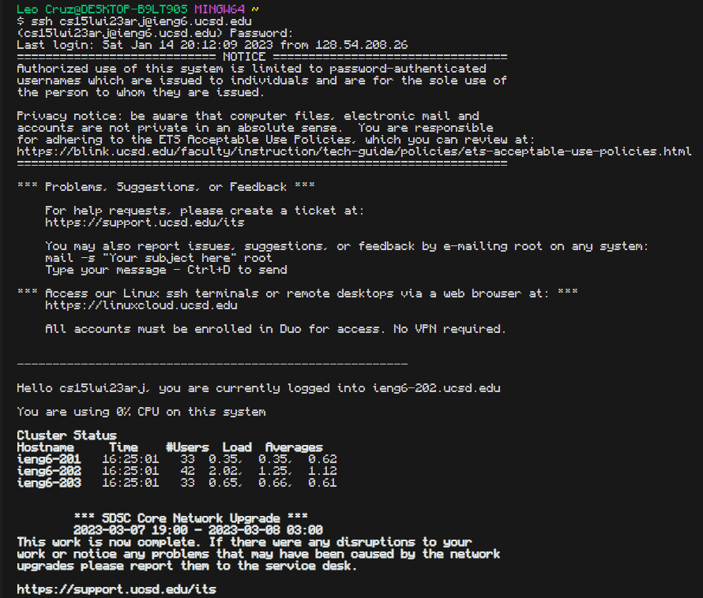
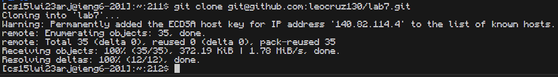
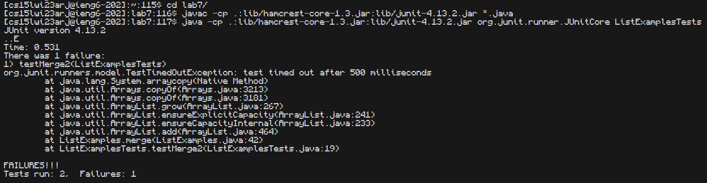
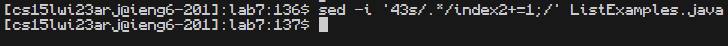
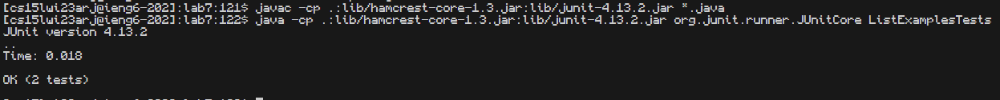
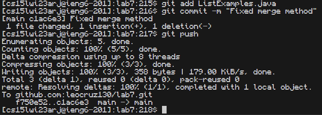

# Lab Report 4 - CSE Labs "Done Quick" Walkthrough

In order to get through these steps as quickly as I could I used a google document that contained the following.

## Step 1: Accessing ieng6 account

keys pressed: `<Ctrl + C><Ctrl + V><Enter>`, `<Ctrl + C><Ctrl + V><Enter>`

### Step 1: Explained

To begin accessing my ieng6 account I have to copy and paste the command `ssh cs15lwi23arj@ieng6.ucsd.edu` from the doc I have on the side and paste it. Next I copy my password from the same doc and paste it and press enter giving me access to my ieng6 account.

## Step 2: Cloning The Fork of The Repository From Github

keys pressed: `<Ctrl + C><Ctrl + V><Enter>`

### Step 2: Explained

In order to clone my fork from the github I copied and pasted the command `git clone git@github.com:leocruz130/lab7.git` from the same doc as step 1 and pressed enter. This creates a clone of lab7 into my ieng6 directory.

## Step 3: Running JUnit Tests, Demonstrating The Failing Test

keys pressed: `cd l <Tab><Enter>`, `<Ctrl + C><Ctrl + V><Enter>`, `<Ctrl + C><Ctrl + V><Enter>`

### Step 3: Explained

In order to run and demonstrate the failing tests I first cd into the Lab7 repo I just cloned by using the `cd` command. Once i type cd and space I type the first letter of the repo which is l. Since my ieng6 directory is empty once I press tab it autocompleted to the lab7 directory and I press enter. Once in the lab7 directory I copy the command `javac -cp .:lib/hamcrest-core-1.3.jar:lib/junit-4.13.2.jar *.java` from the doc and pasted it and pressed enter. This compiled the JUnit files and all .java files in the lab7 directory. Then I copy and pasted the following command `java -cp .:lib/hamcrest-core-1.3.jar:lib/junit-4.13.2.jar org.junit.runner.JUnitCore ListExamplesTests` in order to run the JUnit tests in the ListExamplesTests.java file.

## Step 4: Edit The Code File to Fix The Failing Test

keys pressed: `<Ctrl + C><Ctrl + V><Enter>`

### Step 4: Explained

In order to edit the code file and fix the failing test I know that the merge method isn't working and I know the reason for that error is because the last else statement contains `index1 += 1`. To fix that I copy and paste the following command `sed -i ‘43s/.*/index2+=1;/’ ListExamples.java`. The sed command allows me to edit a text file through the terminal and in the code shown I use option `-i` to indicate to the sed command that I want to save the changes into the same file. The `43s/.*/index2+=1;/` indicates that I want to start off at line `43s` of the java file and want to replace the whole line `.*` with the following `index2+=1;` and save the changes in the ListExamples.java file.

## Step 5: Running The Tests, Demonstrating That THey Now Succeed

keys pressed: `<up><up><up><Enter>` , `<up><up><up><Enter>`

### Step 5: Explained

To get the best time possible I use the arrow keys to access my bash history. I use the up arrow 3 times to get the `javac -cp .:lib/hamcrest-core-1.3.jar:lib/junit-4.13.2.jar *.java` again and press enter to compile. Since I just used another command I have to use the up arrow another 3 times to access the `java -cp .:lib/hamcrest-core-1.3.jar:lib/junit-4.13.2.jar org.junit.runner.JUnitCore ListExamplesTests` command to run the JUnit tests again.

## Step 6: Committing and Pushing The Changes to Github

keys pressed: `<Ctrl + C><Ctrl + V><Enter>`, `<Ctrl + C><Ctrl + V><Enter>`, `git push <Enter>`

### Step 6: Explained

To commit and push the changes to github I copy and paste the first command `git add ListExamples.java` that adds the ListExamples file to staged changes. Then I copy and paste the second command `git commit -m "Fixed merge method"` to commit the stages with the commit message explaining that I fixed the merge method. Finally I type git push and press enter to push the staged changes back to the main repo in github.
