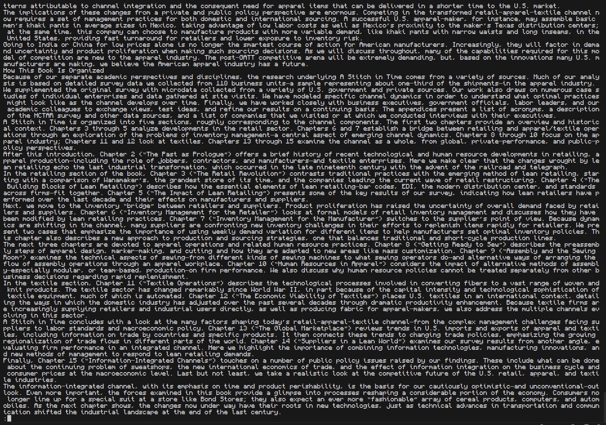

# Lab Report 5 - Researching ``less`` Command Line Arguments

Before starting this lab report I want to clarify that the less command is a text viewer for the terminal so it will be difficult to put the results of the command line arguments into a code block. Instead I opted to using screenshots to easily show what these command line arguments do.

## ``less -E`` Command Line Argument

The ``less -E`` command line argument allows the user to automatically exit upon reaching the end of the file. This is really
useful if someone has to iterate through multiple files and doesn't want to continuously press q at the end of the file.

### ``less -E`` Example #1

In this example, I am reading through ch1.txt in the `written_2/non-fiction/OUP/Abernathy` directory and as I get to the end of the text file I continuously press down until I get back to the terminal shown in the second picture. This is really useful if you're skimming through files and do not want to manually press q when you reach the end.

### ``less -E`` Example #2

In the example above, I am reading through ch2.txt in the `written_2/non-fiction/OUP/Rybczynski` directory. Just like the example before I am reaching the end of the final line and it's important to note that the ``less -E`` command gives you 5 empty spaces after the last line in the text until it takes you back to the terminal screen.

## ``less -N`` Command Line Argument

The ``less -N`` command line argument allows less to display the specificied text file with line numbers. This is really useful for code reviews or paired programming as it makes it easier to locate a specific issue.

### ``less -N`` Example #1

In this example I am looking through DocSearchServer.java. Using the ``less -N`` option I can easily distinguish what line I am looking at. This is useful when working on labs with a lab partner as we can easily communicate what line in a java file contains an error.

### ``less -N`` Example #2

In this example I am looking through the Server.java file using the ``less -N`` option. I am able to easily determine how many lines the file contains without counting every individual line manually. This is useful for situations in which I have a line limit for an assignment and I want to quickly determine if I passed it.

## ``less -p`` Command Line Argument

The ``less -p[pattern]`` command line argument opens the specified text file on the page containing the first item that matches the specified pattern. Its important to know that the search is case-sensitive.

### ``less -p`` Example #1

In this example I am looking through the Server.java class file using ``less -pclass`` to find and highlight the first instance where class is used in the text. This is useful if I want to make sure that specific variables or methods were used in a java file.

### ``less -p`` Example #2

In this example I am using ``less -pTestListExamples`` in the TestListExamples.java file. This example highlights that when using the `-p` command line argument the path you give will be case-sensitive. As I capitalized the T,L, and E in the path the first instance that gets highlighted will be the class name `TestListExamples`.

## ``less -X`` Command Line Argument

Usually when exiting the less text viewer it clears the terminal of the page you were just viewing but with the ``less -X`` command line argument it disables clearing the screen after quitting. This is useful when looking at short files because the contents is quickly accessible above.

### ``less -X`` Example #1

In this example I am in the `written_2/non_fiction/OUP/Abernathy` directory using ``less -x`` on ch1.txt. This allows me to quit and keep the page I was currently looking at to stay on my terminal. This is useful for someone that wants to use a specific part of a text in their next terminal command.

### ``less -X`` Example #2

In this example I am using `less -X` command line argument on Server.java. Since Server.java is a relatively short file when I press q I can see the whole java file above my terminal. This is very useful when combining multiple command line options like `-N` to more easily view the line numbers and still be able to use the terminal for other commands.