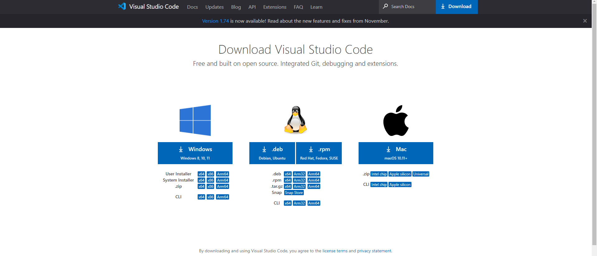
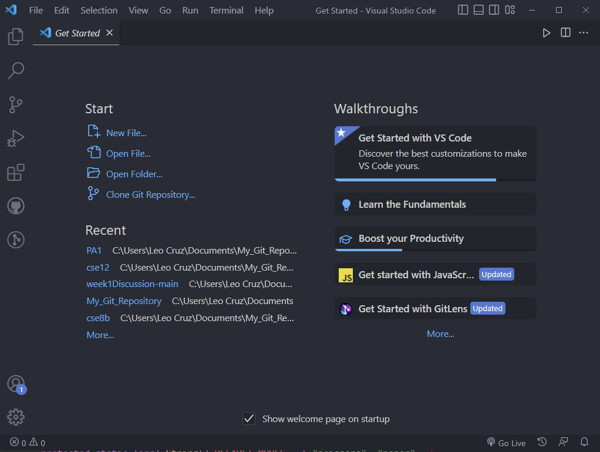
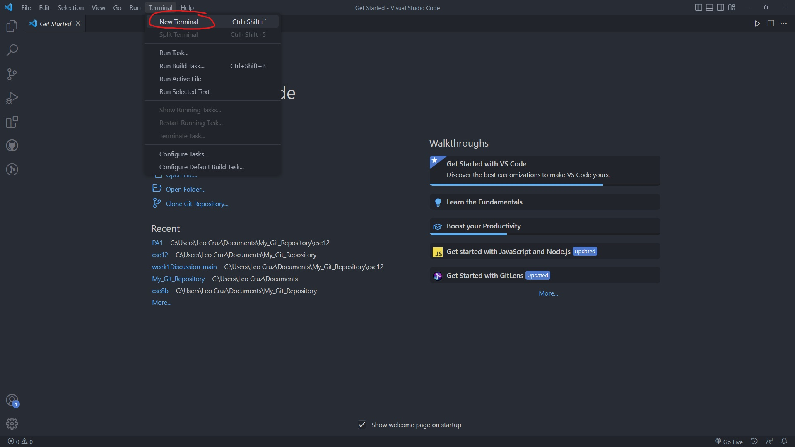
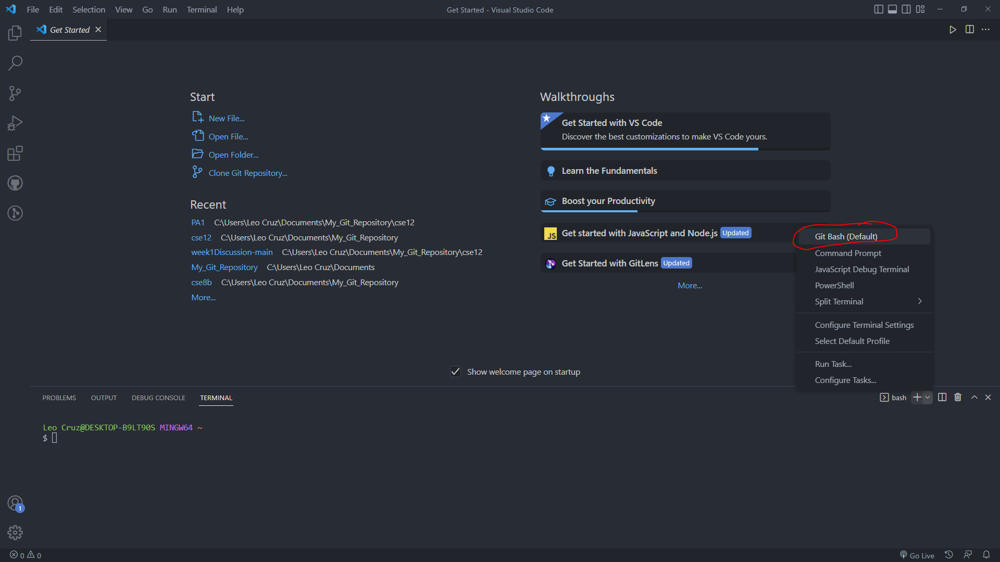
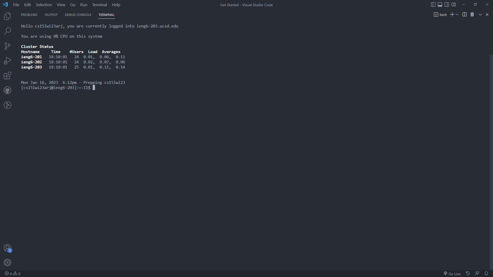
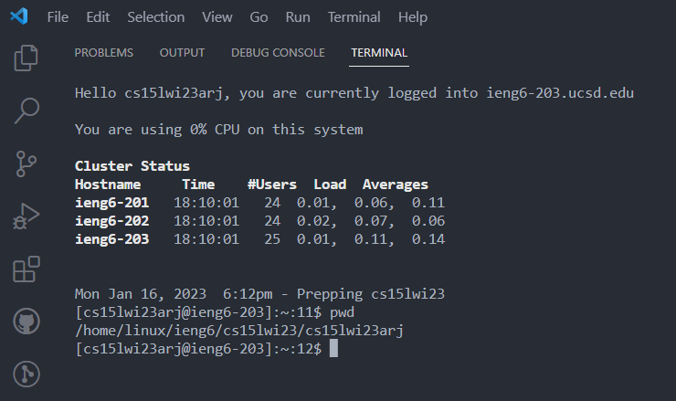
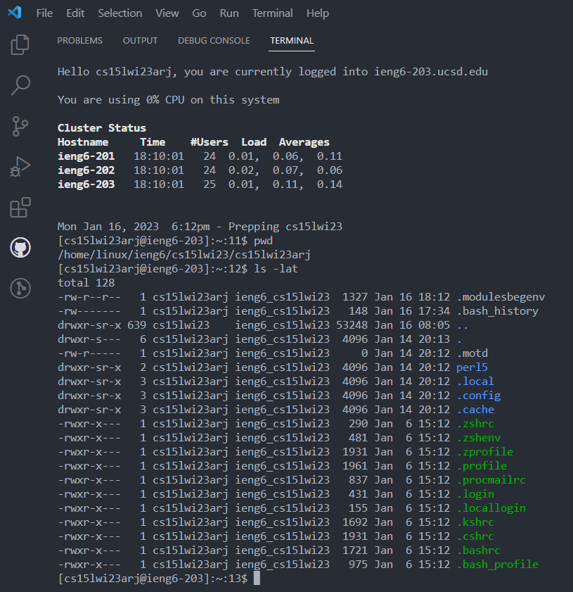

# Week 1 Lap Report

## Installing VS-Code & Git

To install vs-code make sure you go to this [link](https://code.visualstudio.com/download).
You should download the correct version of VS-code depending on what OS your computer is running.

Furthermore, if you're on a Mac or Linux device you may already have git preinstalled into your device.
If not or you're on a Windows device click on this [link](https://git-scm.com/downloads) and make sure you're installing the right version for your OS.
Once installed you should have a screen similar to this.

## Remote Connecting

Once you get to this screen look at the top bar of your screen and click on Terminal -> New Terminal.

Click on the arrow on the bottom right and click Git Bash and once prompted enter the command ``ssh CSE15LSTUDENTACCOUNTEXAMPLE@ieng6.ucsd.edu``.

Make sure to replace the student account example with your own.
Once prompted enter your password and your screen should look something like this.

## Running Some Commands

To make sure your system is functioning correctly lets try running some commands.
Entering ``pwd`` should print out your current working directory and should look a little something like this.

Entering ``ls`` should list you all files or directories in your current directory.
But by using the ``-lat`` option we are asking the bash terminal to list files in a long format, showing hidden files and sorting them by date and time. l corresponding to long format, a corresponding to showing hidden files, and t corresponding to sorting them by date and time.
You might receive an error if the directory you're working in has too many files to display.

And just like that you have set up and logged in to your virtual system.
