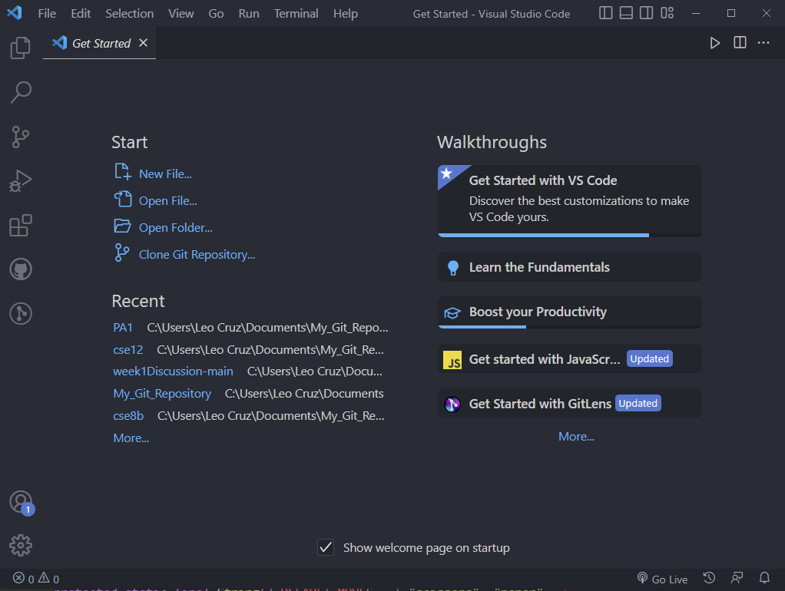
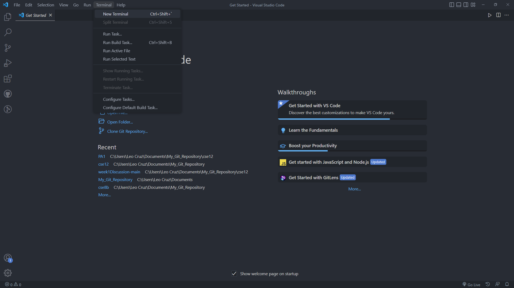
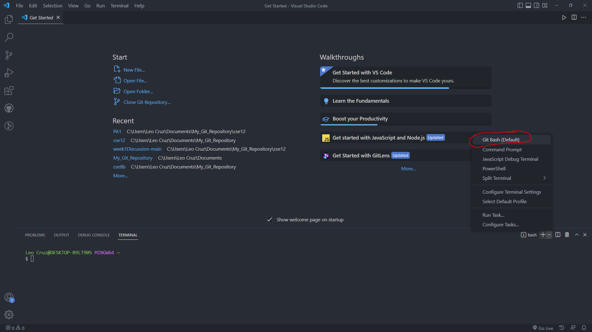
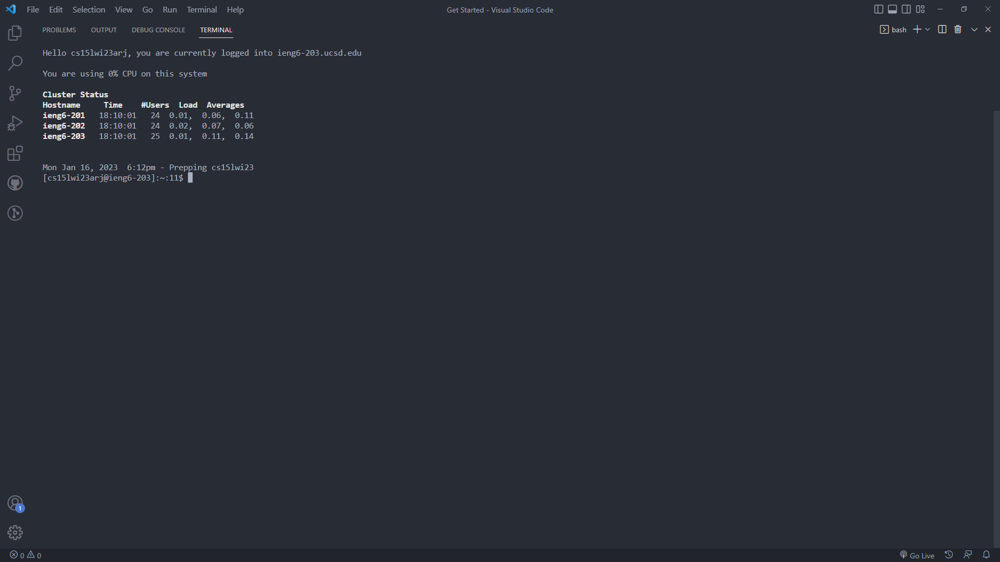
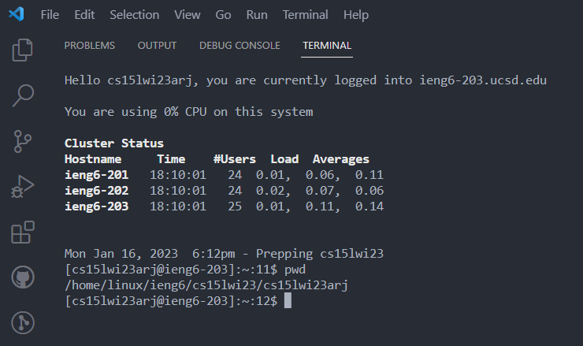
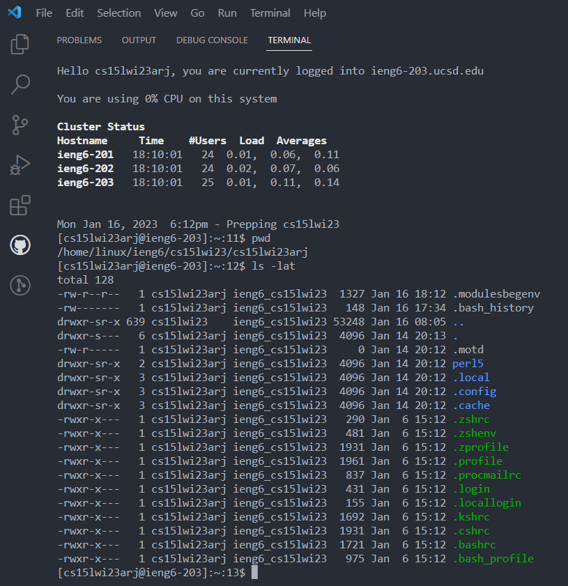

# Week 1 Lap Report

## Installing VS-Code & Git

To install vs-code make sure you go to this [link](https://code.visualstudio.com/download).\
Furthermore, make sure to install git as well with this [link](https://git-scm.com/downloads).\
and make sure you're installing the right version for your OS.\
once installed you should have a screen similar to this.

## Remote Connecting

Once you get to this screen look at the top bar of your screen and click on Terminal -> New Terminal.\

Click on the arrow on the bottom right and click Git Bash and once prompted enter the command **ssh CSE15LSTUDENTACCOUNTEXAMPLE@ieng6.ucsd.edu**\

Make sure to replace the student account example with your own.\
Once prompted enter your password and your screen should look something like this.\

## Running Some Commands

To make sure your system is functioning correctly lets try running some commands.\
Entering **pwd** should give you something like this.\

Entering **ls -lat** should give you something like this.\

And just like that you have set up and logged in to your virtual system.

