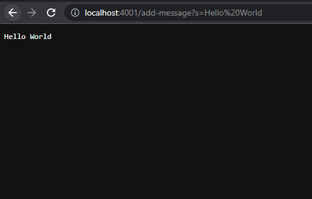
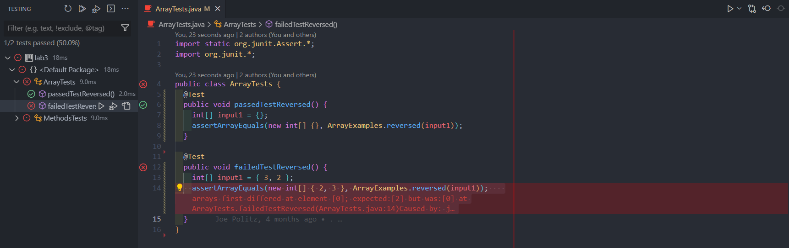

# Lab Report

## Part 1

Here I created a web server called StringServer that concatenates the string after the query ``=`` and a new line (``\n``) to the running string.

```java
 import java.io.IOException;
import java.net.URI;

class Handler implements URLHandler {
    // The one bit of state on the server: a number that will be manipulated by
    // various requests.
    String words = "";

    public String handleRequest(URI url) {
        if (url.getPath().equals("/")) {
            return String.format(words);
        } else {
            System.out.println("Path: " + url.getPath());
            if (url.getPath().contains("/add-message")) {
                String[] parameters = url.getQuery().split("=");
                if (parameters[0].equals("s")) {
                    String word = parameters[1];
                    words = words + word + "\n";
                    return String.format(words);
                }
            }
            return "404 Not Found!";
        }
    }
}

class StringServer {
    public static void main(String[] args) throws IOException {
        if (args.length == 0) {
            System.out.println("Missing port number! "
                + "Try any number between 1024 to 49151");
            return;
        }

        int port = Integer.parseInt(args[0]);
        //Server class implemented on another file.
        Server.start(port, new Handler());
    }
}
```

Here it is in action.\


- In this example the main method of StringServer & the handleRequest method of Handler are being called to execute this screen.
- For the main method of StringServer args would be considered the port number when initializing the server. It is important that you get to choose what port number to start your server as it helps deliver data to the wanted host on the network.
- the handleRequest method takes in the url that we typed and converts the url value to a string array value to add the right hand side of the query to the words string.


-In this example we can see when we enter in the url a new query adding integers is still considered as a string.
-Both the main method of StringServer & the handleRequest method of Handler are still being called.
-The important thing about this example is that in the URL value we have integer values that still get added and formatted to string values.

## Part 2

```java
import static org.junit.Assert.*;
import org.junit.*;

public class ArrayTests {
    @Test
    public void passedTestReversed() {
        int[] input1 = { };
        assertArrayEquals(new int[]{ }, ArrayExamples.reversed(input1));
  }
   @Test 
    public void failedTestReversed() {
        int[] input1 = { 3, 2 };
        assertArrayEquals(new int[]{ 2, 3 }, ArrayExamples.reversed(input1));
 }
}
```



The ``@Test`` code line signifies to JUnit that the method under it is a test and through the screenshot its clear that passedTestReversed() passed and failedTestReversed() failed. The symptom shown in the failed tests shows that when the array is length more than 1 fails to produce a new reversed array. In the following code snippets I'll detail the before and after code change required to fix it.

### Before

```java
  static int[] reversed(int[] arr) {
    int[] newArray = new int[arr.length];
    for (int i = 0; i < arr.length; i += 1) {
      arr[i] = newArray[arr.length - i - 1];
    }
    return arr;
  }
```

### After

```java
  static int[] reversed(int[] arr) {
    int[] newArray = new int[arr.length];
    for (int i = 0; i < arr.length; i += 1) {
      newArray[arr.length - i - 1] = arr[i];
    }
    return newArray;
  }
```

The issues with the first program was that it was assigning the empty values of the new array we created to our original arr. Another issue was that after executing the for loop we would return the original arr which is not the new array we are looking for. So our fix addresses these issues by first making sure that the newArray was being assigned the values of arr in reverse order and that we would return this new array after the for loop executes.

## Part 3

Some things that I learned through week 2 and week 3 labs was being able to create a web server that can work with java code. This interested me because my limited knowledge led me to believe that programs like python were the only ones that could work with web servers. Also being able to decompose a URL to its various parts like the domain, path, and even queries.
