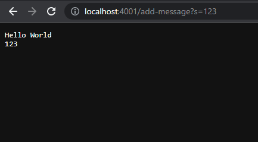

# Lab Report

## Part 1

Here I created a web server called StringServer that concatenates the string after the query ``=`` and a new line (``\n``) to the running string.

```java
 import java.io.IOException;
import java.net.URI;

class Handler implements URLHandler {
    // The one bit of state on the server: a number that will be manipulated by
    // various requests.
    String words = "";

    public String handleRequest(URI url) {
        if (url.getPath().equals("/")) {
            return String.format(words);
        } else {
            System.out.println("Path: " + url.getPath());
            if (url.getPath().contains("/add-message")) {
                String[] parameters = url.getQuery().split("=");
                if (parameters[0].equals("s")) {
                    String word = parameters[1];
                    words = words + word + "\n";
                    return String.format(words);
                }
            }
            return "404 Not Found!";
        }
    }
}

class StringServer {
    public static void main(String[] args) throws IOException {
        if (args.length == 0) {
            System.out.println("Missing port number! "
                + "Try any number between 1024 to 49151");
            return;
        }

        int port = Integer.parseInt(args[0]);
        //Server class implemented on another file.
        Server.start(port, new Handler());
    }
}
```

Here it is in action.\


- In this example the main method of StringServer & the handleRequest method of Handler are being called to execute this screen.
- For the main method of StringServer args would be considered the port number when initializing the server. It is important that you get to choose what port number to start your server as it helps deliver data to the wanted host on the network.
- the handleRequest method takes in the url that we typed and converts the url value to a string array value to add the right hand side of the query to the words string.



-In this example we can see when we enter in the url a new query adding integers is still considered as a string.
-Both the main method of STringServer & the handleRequest method of Handler are still being called.
-The important thing about this example is that in the URL we have integer values that still get added and formatted to string values.

## Part 2

